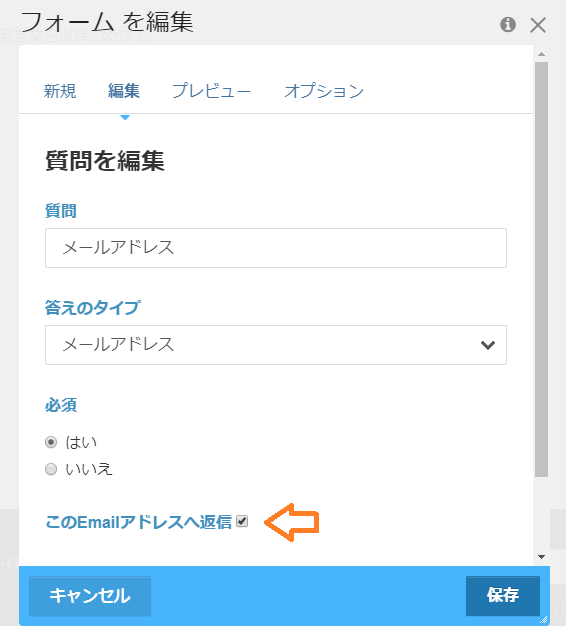

# ounziw_form_autoreply
concrete5のレガシーフォーム(expressではなくて、5.7系からあるフォーム)に、自動返信機能を追加する。
イベント機能(WordPressのアクションフックのようなもの)を活用して、フォームブロックの処理の途中で追加の処理を行っている。

## 導入方法
このリポジトリをダウンロードし、concrete5 の packages フォルダに置く。 
concrete5 管理画面で有効化すると、自動返信機能が有効になる。

## 設定
フォームブロックの項目にメールアドレスがある。
『このEmailアドレスへ返信』をチェックすると、入力されたメールアドレスへ自動返信する。

入力されたメールアドレスが妥当でない場合(FILTER_VALIDATE_EMAILで検証している)や、『このEmailアドレスへ返信』がチェックされていない場合は、自動返信は行わない。

## 自動返信メールの内容の編集
ver.0.7では、controller.phpのon_start()メソッドを編集する。
利用者が多くなれば、管理画面から返信内容を設定できるように改良する予定。

## 活用事例
[自動計算フォーム:運営会社](https://calculator.jp/company)

[マイ見積:問い合わせ](https://my-mitsu.jp/contact)

## ライセンス
MIT